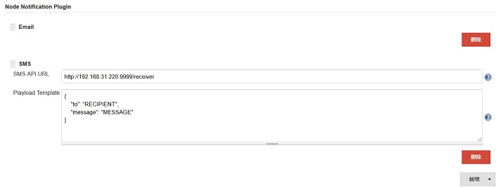
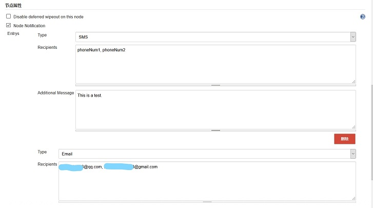

# Node Notification Plugin

This plugin allows sending notifications when a node is offline.

## Installation

Clone this repo on your disk, navigate into folder `node-notification-plugin` and run command `mvn verify`, when it completed, upload `target/node-notification.hpi` to the update center of Jenkins and install it.

## Configuration

* Global Configuration
Go to manage > configure > Node Notification Plugin, for example:

	
	

		<em>Global Configuration Example</em>
	

* Node Configuration
Go to node configure page and add node notification properity, for example:

	
	

		<em>Node Properity Configuration Example</em>
	

