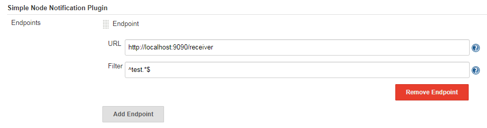

## Simple Node Notification Plugin

这个插件能够将Jenkins中所有节点的状态的变化发送到指定的 HTTP Endpoint。

### 配置方法
导航到系统管理 > 系统配置 > Simple Node Notification Plugin，配置 HTTP URL 和选择性的配置正则表达式 regex 来过滤节点，例如：

	
	

		<em>配置示例</em>
	

